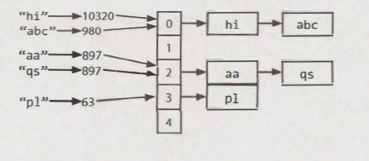

# Arrays & String

Hy vọng rằng tất cả bạn đọc đều biết ít nhiều về mảng và chuỗi, vì vậy chúng tôi sẽ không nhắc lại những khái niệm chi tiết. Thay vào đó, chúng tôi sẽ tập trung vào một số kỹ thuật và vấn đề phổ biến hơn với các cấu trúc dữ liệu này.

Xin lưu ý rằng câu hỏi cho mảng và chuỗi thường có thể hoán đổi cho nhau. Có nghĩa là, một câu hỏi được nêu ra bằng cách sử dụng một mảng có thể được hỏi thay thế dưới dạng một câu hỏi chuỗi và ngược lại.

## Bảng băm

Bảng băm (hash table) là một cấu trúc dữ liệu ánh xạ các khoá với giá trị để tìm kiếm hiệu quả. Có nhiều cách để triển khai bảng băm, ở đây chúng tôi mô tả triển khai đơn giản và phổ biến nhất.

Ở triển khai này, ta dùng một mảng danh sách liên kết và hàm băm. Để chèn một khoá (có thể là kiểu chuỗi hoặc bất kỳ kiểu nào khác) và giá trị ta làm như sau:
1. Đầu tiên, tính toán code của khoá băm, thường là kiểu `int` hoặc `long`. Lưu ý, hai khoá khác nhau có thể có cùng code băm, vì có thể có vô số khóa còn `int` thì hữu hạn.
2. Sau đó, ánh xạ code băm với chỉ mục trong mảng. Điều này có thể thực hiện với một vài cách như `hash (key) % array_length`. Hai code băm khác nhau có thể có cùng chỉ mục.
3. Ở chỉ mục này, đây là một danh sách liên kết của khoá và giá trị. Lưu trữ khoá và giá trị trong chỉ mục này. Ta phải dùng danh sách liên kết vì xung đột: bạn có thể có hai khoá khác nhau, có cùng code băm, hoặc hai code băm khác nhau ánh xạ cùng chỉ mục.

Để truy xuất giá trị từ khoá cùng cặp, ta lặp lại quá trình trên. Tính toán code băm từ khoá, và tính toán chỉ mục từ code. Sau đó, tìm kiếm qua danh sách liên kết cho giá trị với khoá này.

Nếu số lượng xung đột quá cao, trường hợp tệ nhất là `O(N)` với N là số lượng khoá. Tuy nhiên, chúng tôi thường giả định một triển khai tốt giữ cho xung đột ở mức tối thiểu, trong trường hợp đó, thời gian tra cứu là `O(1)`.



Ngoài ta, ta có thể triển khai bảng băm với cây nhị phân tìm kiếm. Nó trả về `O(logN)` thời gian tìm kiếm. Lợi thế của triển khai này là có thể sự dụng ít không gian hơn, vì ta không cấp phát cho một mảng lớn nữa. Ta có thể lặp các khoá theo thứ tự, điều này đôi khi hữu ích.

## ArrayList & Resizable Arrays 

Ở một vài ngôn ngữ, mảng (array, cũng có thể là list) được thay đổi kích thước tự động. Mảng sẽ tăng lên khi thêm mục vào mảng. Một số ngôn ngữ, như Java kích thước của mảng là cố định. Kích thước được định nghĩa khi tạo mảng.

Khi bạn cần một mảng như cấu dữ liệu có thể thay đổi kích thước, ta sẽ dụng một ArrayList. Một ArrayList là một mảng có thể thay đổi kích thước của nó khi cần trong khi vẫn cung cấp khả năng truy cập `O(1)`. Một cách triển khai điển hình là khi mảng đầy, kích thước của mảng tăng gấp đôi. Mỗi lần nhân đôi như vậy mất `O(n)` thời gian, nhưng hiếm khi xảy ra đến mức thời gian chèn khấu hao của nó vẫn là `O(1)`.

```java
Arraylist<String> merge(String[] words, String[] more) {
    Arraylist<String> sentence= new Arraylist<String>();
    for (String w: words) sentence.add(w);
    for (String w: more) sentence.add(w);
    return sentence;
}
```

Đây là cấu trúc dữ liệu thiết yếu trong các cuộc phỏng vấn. Đảm bảo là bạn thấy thoải mái với mảng/danh sách kích thước động với bất kỳ ngôn ngữ lập trình nào. Lưu ý tên và hệ số thay đổi của cấu trúc dữ liệu có thể khác nhau.

*Tại sao thời gian chèn khấu hao lại là O(1)?*

Giả sử bạn có một mảng với kích thước N. Chúng tôi có thể làm việc ngược lại để tính toán số lượng phần tử chúng tôi đã sao chép ở mỗi lần tăng kích thước. Quan sát điều đó, khi ta tăng mảng lên K phần tử, mảng trước sẽ có kích thước bằng một nữa. Do đó, ta chỉ cần sao chép một phần hai của K phần tử.

- Kích thước tăng cuối cùng: n/2 phần tử cần sao chép.
- Kích thước tăng trước đó: n/4 phần tử cần sao chép.
- Kích thước tăng trước đó: n/8 phần tử cần sao chép.
- Kích thước tăng trước đó: n/16 phần tử cần sao chép.
...
- Kích thước tăng thứ hai: 2 phần tử cần sao chép.
- Kích thước tăng đầu tiên: 1 phần tử cần sao chép.

Do đó, tổng số lượng cần sao chép để chèn N phần tử sẽ là `N/2 + N/4 + N/8 + ... + 2 + 1`, sẽ luôn nhỏ hơn N.

Cuối cùng, việc chèn N phần tử mất `O(N)` tổng cộng. Mỗi lần chèn mất `O(1)` thời gian trung bình, mặc dù trường hợp xấu nhất sẽ mất `O(N)` thời gian.

## StringBuilder

Tượng tượng bạn đang nối một danh sách chuỗi, như bên dưới. Thời gian chạy của đoạn code này là bao nhiêu? Để đơn giản, giả sử rằng các chuỗi đều có cùng độ dài (gọi đây là x) và có n chuỗi

```java
String joinWords(String[] words) {
    String sentence = "";
    for (String w: words) {
        sentence = sentence + w;
    }
    return sentence;
}
```

Mỗi lần nối, một bản sao mới của chuỗi sẽ được tạo, và hai chuỗi sao chép lẫn nhau, qua từng ký tự. Lần lặp đầu tiên yêu cầu chúng ta sao chép `x` ký tự. Lần lặp thứ hai yêu cầu sao chép `2x` ký tự... Do đó, tổng thời gian là `O(x + 2x + ... + Nx)`. Điều này làm giảm thời gian thành `O(xn^2)`.

> Tại sao là O(xn^2)? Vì 1 + 2 + ... + n = n(n+1)/2 ~ n^2

StringBuilder có thể giúp bạn tránh vấn đề này. Nó tạo một mảng kích thước động cho tất cả chuỗi, sao chép chúng chỉ khi cần thiết.

```java
String joinWords(String[] words) {
    StringBuilder sentence new StringBuilder();
    for (String w: words) {
        sentence.append(w);
    }
    return sentence.toString();
}
```

Một bài tập tốt để thực hành chuỗi, mảng và cấu trúc dữ liệu chung là tự thân triển khai String Builder, HashTable và ArrayList.

## Câu hỏi phỏng vấn

1. [**Is Unique:**](./1.IsUnique) Triển khai thuật toán xác định một chuỗi có tất cả các ký tự duy nhất hay không.
2. [**Check Permutation:**](./2.CheckPermutation) Cho hai chuỗi, viết một phương thức quyết định xem có phải hoán vị hay không.
3. [**URLify:**](./3.StringtoURL/) viết một phương thức thay thế tất cả khoảng trống trong chuỗi với `%20`. Bạn có thể giả định rằng chuỗi có đủ khoảng trống ở cuối để chứa các ký tự bổ sung và bạn được cung cấp độ dài "thực" của chuỗi. (Lưu ý: Nếu triển khai bằng Java, vui lòng sử dụng mảng ký tự để bạn có thể thực hiện thao tác này tại chỗ.)
4. [**Palindrome Permutation:**](./4.PalindromePermutation/) Cho một chuỗi, hãy viết một hàm để kiểm tra xem nó có phải là hoán vị của một palindrome hay không. Palindrome là một từ hoặc cụm từ giống nhau ngay cả khi viết ngược. Hoán vị là sự sắp xếp lại các chữ cái. Palindrome không cần chỉ giới hạn trong các từ điển.
5. [**One Away:**](./5.OneAway/) Có ba loại chỉnh sửa có thể được thực hiện trên chuỗi: chèn ký tự, xóa ký tự hoặc thay thế ký tự. Cho hai chuỗi, hãy viết một hàm để kiểm tra xem chúng có phải là một lần chỉnh sửa (hoặc không có lần chỉnh sửa nào).
6. [**String Compression:**](./6.CompressString/) Triển khai một phương thức để thực hiện nén chuỗi cơ bản bằng cách sử dụng số lượng các ký tự được lặp lại. Ví dụ, chuỗi aabcccccaaa sẽ trở thành a2blc5a3. Nếu chuỗi "nén" không trở nên nhỏ hơn chuỗi ban đầu, phương thức của bạn sẽ trả về chuỗi ban đầu. Bạn có thể giả sử chuỗi chỉ có chữ hoa và chữ thường (a - z).
7. [**Rotate Matrix:**](./7.RotateMatrix/) Cho một hình ảnh được biểu diễn bằng ma trận NxN, trong đó mỗi pixel trong hình ảnh là 4 byte, hãy viết một phương thức để xoay hình ảnh 90 độ. Bạn có thể làm điều này tại chỗ không?
8. [**Zero Matrix:**](./8.ZeroMatrix/) Viết thuật toán sao cho nếu một phần tử trong ma trận MxN là 0, thì toàn bộ hàng và cột của nó được đặt thành 0.
9. [**String Rotation:**](./9.StringRotation/) Giả sử bạn có một phương thức isSubstring mà kiểm tra xem một từ khóa có phải là một chuỗi con của một từ khóa khác hay không. Cho hai chuỗi, sl và s2, hãy viết mã để kiểm tra xem s2 có phải là vòng quay của sl chỉ bằng cách sử dụng một lệnh gọi đến isSubstring (ví dụ: "waterbottle" là vòng quay của "erbottlewat").